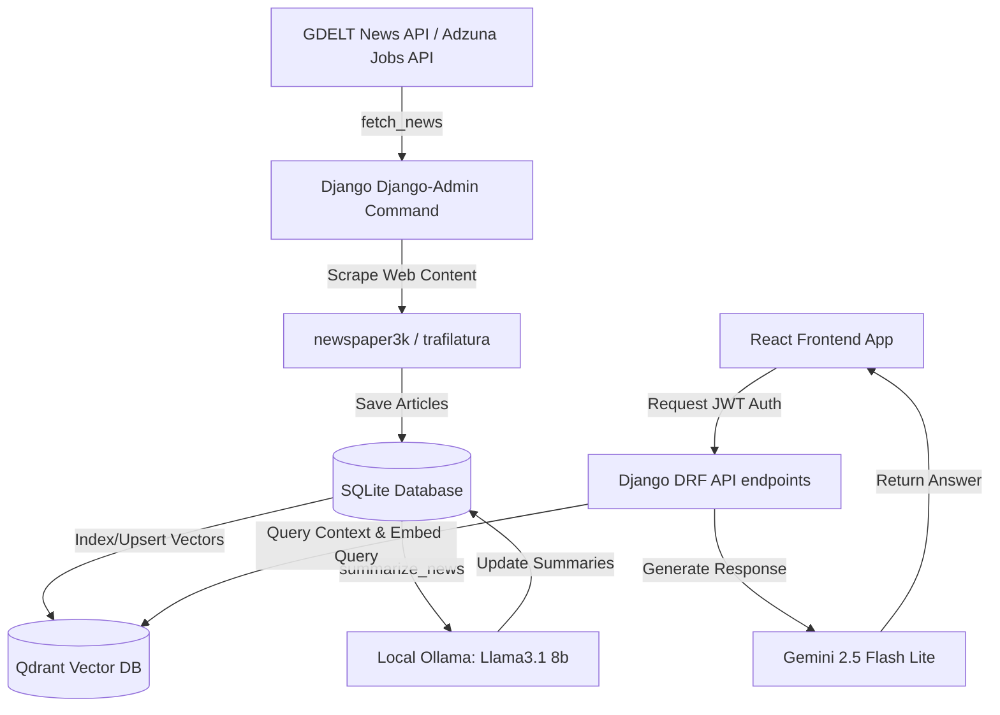

# Geo-Economy Analyzer AI

An advanced, full-stack AI-driven news intelligence and job-market analysis platform. The application dynamically aggregates global geopolitical and labor market news, extracts full article content, builds a local vector database for semantic search, generates high-quality structured summaries via a local LLM, and exposes interactive analytics, live job listings, and career comparison interfaces.

---

## 🚀 Key Features

* **Global News Aggregation:** Automates crawling of global economic and geopolitical news (e.g., layoffs, hiring booms, emerging skills) using the **GDELT Project API** with robust rate-limiting and query chunking.
* **Intelligent Web Crawling:** Parses full-text article content using `newspaper3k` and `trafilatura` scrapers with fallback option mechanisms.
* **Offline AI Summarization & Categorization:** Processes raw, imported articles in database-efficient batch iterators, using a local **Ollama** model (`llama3.1:8b`) to classify and generate stylized markdown reports.
* **Semantic Vector Search (RAG):** Uses a local **Qdrant Vector Database** to index 3072-dimensional article embeddings generated via `gemini-embedding-001`.
* **RAG-powered General Assistant:** Provides an authenticated chat experience where an AI agent acts as a career consultant, grounding answers in retrieved news context from the vector database.
* **Interactive Article Chat:** Allows users to converse with individual news articles using contextual Gemini prompts.
* **Live Job Search & Salary Trend Tracking:** Integrates the **Adzuna API** to search real-time global listings and analyze 12-month historical salary patterns to compute industry growth metrics.
* **Career Comparison Dashboard:** Allows users to select and compare two separate careers side-by-side on metrics such as average salary, growth, skill demand, and work-life balance using structured JSON outputs.
* **Premium UX/UI:** Feature-rich dashboard built with **React 19**, styled with **Tailwind CSS v4**, and animated using **Framer Motion** and **Anime.js** for micro-interactions and transitions.

---

## 🛠️ Technology Stack

| Layer | Technologies |
| :--- | :--- |
| **Frontend** | React 19, Vite, Tailwind CSS v4, Framer Motion, Anime.js, React Router v7, React Markdown (GFM, Sanitization) |
| **Backend & API** | Python, Django, Django REST Framework (DRF), SimpleJWT (JWT Authentication), SQLite |
| **AI / Embeddings** | Google GenAI SDK (`gemini-2.5-flash-lite`, `gemini-embedding-001`), Ollama (`llama3.1:8b`) |
| **Vector DB** | Qdrant Vector Database (Cosine Distance, Port 6333) |
| **Data Scraping** | Requests, BeautifulSoup4, Newspaper3k, Trafilatura, Tenacity (exponential backoff retry utility) |

---

## 📂 System Architecture & Pipelines



---

## ⚙️ Configuration & Environment Variables

Create a `.env` file in the root directory:

```env
# Django Settings
DJANGO_SECRET_KEY='your-django-secret-key'
DEBUG=True

# Google GenAI Settings
GEMINI_API_KEY='your-gemini-api-key'

# Adzuna API Credentials (Get at https://developer.adzuna.com/)
ADZUNA_APP_ID='your-adzuna-app-id'
ADZUNA_APP_KEY='your-adzuna-app-key'
```

---

## 🛠️ Installation & Setup

### Prerequisites
* **Python 3.10+**
* **Node.js 18+**
* **Qdrant Vector Database** (Running locally on `localhost:6333`)
  ```bash
  docker run -p 6333:6333 -p 6334:6334 -v qdrant_storage:/qdrant/storage qdrant/qdrant
  ```
* **Ollama** installed with `llama3.1:8b` pulled:
  ```bash
  ollama pull llama3.1:8b
  ```

---

### Step 1: Backend Setup
1. **Initialize a Virtual Environment:**
   ```bash
   python -m venv .venv
   # Windows:
   .\.venv\Scripts\activate
   # Linux/macOS:
   source .venv/bin/activate
   ```
2. **Install Dependencies:**
   ```bash
   pip install -r requirements.txt
   ```
3. **Run Database Migrations:**
   ```bash
   python manage.py makemigrations
   python manage.py migrate
   ```
4. **Seed Initial News Topics:**
   ```bash
   python manage.py seed_topics
   ```
5. **Start Django REST Server:**
   ```bash
   python manage.py runserver
   ```

---

### Step 2: Data Ingestion & Indexing Pipeline
Run the background commands sequentially to ingest and index articles:

1. **Fetch & Crawl News Articles:**
   Fetches geo-economic / layoff-related news matching predefined keywords from GDELT, crawls full text, and registers them in the database:
   ```bash
   python manage.py fetch_news
   ```
2. **Generate AI Summaries (Ollama):**
   Summarizes newly fetched articles locally using Ollama (`llama3.1:8b`) with specialized job-market analysis templates:
   ```bash
   python manage.py summarize_news
   ```
3. **Index Articles in Vector DB:**
   In case any existing database articles need indexing or re-indexing into Qdrant:
   ```bash
   python manage.py index_raw_news
   ```

---

### Step 3: Frontend Setup
1. **Navigate to the frontend folder:**
   ```bash
   cd frontend
   ```
2. **Install Dependencies:**
   ```bash
   npm install
   ```
3. **Start the Development Server:**
   ```bash
   npm run dev
   ```
   Open `http://localhost:5173` to explore the dashboard.

---

## 🛡️ License

This project is licensed under the MIT License - see the [LICENSE](file:///c:/Users/abhib/test/geo-economy-analyzer-ai/LICENSE) file for details.
